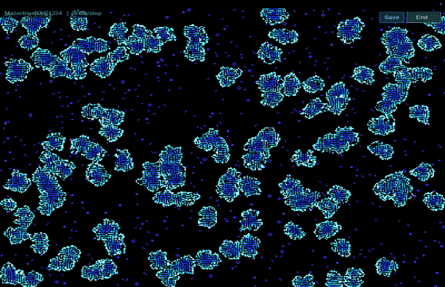
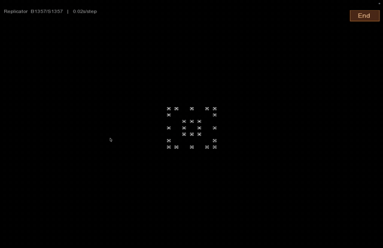
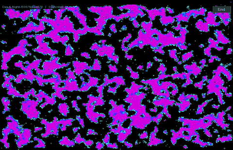

# Cellular Automata Playground

A 2D cellular automata simulator built in C++ with SFML. Explore 32 preset rulesets — from Conway's Game of Life to fractal replicators - or define your own using Birth/Survival notation. Features age-based color rendering, adjustable grid resolution down to 1px per cell (480,000 cells), and real-time speed control.

<p align="center">
  
</p>

<p align="center">
  
  &nbsp;&nbsp;
  
</p>

Inspired by Stephen Wolfram's *A New Kind of Science* and the idea that extraordinarily complex behavior can emerge from extremely simple rules.

## What Are Cellular Automata?

A cellular automaton is a grid of cells, each either alive or dead. Every step, each cell's next state is determined by a fixed rule applied to its neighborhood (the 8 surrounding cells in 2D). Despite the simplicity of the rules, the resulting behavior can range from static patterns to chaotic turbulence to self-replicating fractals — and the only way to find out what a given rule does is to run it. Wolfram calls this *computational irreducibility*.

This project uses **outer totalistic** rules in **B/S notation**:
- **B** (Birth): the neighbor counts that cause a dead cell to become alive
- **S** (Survival): the neighbor counts that let a living cell stay alive

For example, Conway's Game of Life is **B3/S23** — a dead cell is born with exactly 3 neighbors, and a living cell survives with 2 or 3.

## Getting Started

### Quick Setup (Recommended)

Setup scripts that install dependencies and compile automatically:

**macOS / Linux:**

```bash
./setup.sh
```

**Windows:**

```bat
setup.bat
```

### Manual Setup

#### Prerequisites

- A C++ compiler with C++17 support (GCC, Clang, or MSVC)
- [SFML 2.x](https://www.sfml-dev.org/)

#### macOS (Homebrew)

```bash
brew install sfml@2
```

#### Ubuntu/Debian

```bash
sudo apt install libsfml-dev
```

#### Build

**macOS (Homebrew):**

```bash
g++ -std=c++17 -o cellular_automata \
    Main.cpp Grid.cpp RuleSet.cpp Cell.cpp Menu.cpp Settings.cpp \
    -I/opt/homebrew/opt/sfml@2/include \
    -L/opt/homebrew/opt/sfml@2/lib \
    -lsfml-graphics -lsfml-window -lsfml-system
```

**Linux:**

```bash
g++ -std=c++17 -o cellular_automata \
    Main.cpp Grid.cpp RuleSet.cpp Cell.cpp Menu.cpp Settings.cpp \
    -lsfml-graphics -lsfml-window -lsfml-system
```

### Run

```bash
./cellular_automata
```

The application opens to a rule selection menu. Pick a preset (or define custom rules), then the simulation begins.

## Controls

### Menu

| Action | Control |
|--------|---------|
| Navigate rules | Up/Down arrows or mouse wheel |
| Select a rule | Enter or click |
| Open custom rules editor | Click "Custom Rules..." at the bottom of the list |
| Adjust density / cell size / speed | Click the button rows at the top |
| Quit | Esc |

### Simulation

| Action | Control |
|--------|---------|
| Pause / resume | P |
| Randomize grid | R |
| Toggle a cell | Left click |
| Speed up | + (equals key) |
| Slow down | - (hyphen key) |
| Return to menu | Click "End" button (top-right) or press M |
| Quit | Esc |

## Features

### 32 Preset Rulesets (7 Categories)

| Category | Rules |
|----------|-------|
| **Classic** | Conway's Game of Life, HighLife, Life 34, Pseudo Life, Inverse Life |
| **Chaotic** | Seeds, Serviettes, Live Free or Die, Long Life, Gnarl |
| **Fractal** | Replicator, Fredkin |
| **Growth** | Life without Death, Coral, Land Rush, Bugs, Bacteria |
| **Organic** | Diamoeba, Amoeba, Holstein, Vote |
| **Structured** | Day & Night, Anneal, Maze, Mazectric, Gems, Stains, Walled Cities |
| **Other** | Morley (Move), 2x2, Coagulations, Assimilation |

### Custom Rules

The custom rules editor lets you toggle birth and survival conditions (0-8 neighbors) to create any outer totalistic 2D rule. There are 2^18 = 262,144 possible rules.

### Grid Configuration

| Cell Size | Grid Dimensions | Total Cells |
|-----------|----------------|-------------|
| 1px | 800 x 600 | 480,000 |
| 2px | 400 x 300 | 120,000 |
| 3px | 266 x 200 | 53,200 |
| 5px | 160 x 120 | 19,200 |
| 10px (default) | 80 x 60 | 4,800 |
| 15px | 53 x 40 | 2,120 |
| 20px | 40 x 30 | 1,200 |

Smaller cell sizes reveal large-scale emergent structures — this is how Wolfram's visualizations in *A New Kind of Science* are presented.

### Initialization Modes

- **Random 50%** (default) — half the cells start alive
- **Random 25% / 10% / 5%** — sparser starting conditions
- **Single Seed** — one cell in the center (best for symmetric rules like Replicator and Fredkin)
- **Cluster** — small randomized 7x7 group in the center

### Age-Based Coloring

Cells change color the longer they stay alive:

- **White** — just born
- **Cyan** — young
- **Blue** — established
- **Purple** — old
- **Deep magenta** — ancient

Active frontiers glow white while stable structures deepen into blue and purple.

## Things to Try

- **Replicator** + Single Seed + 1px — watch a fractal grow from a single cell, hit the edges, dissolve into apparent chaos, then re-stabilize into new structures
- **Vote** + Random 50% + 2px — majority-rules smoothing creates organic blobs with purple interiors and bright cyan borders
- **Day & Night** + Random 50% + 1px — symmetric rule where alive and dead states are interchangeable, producing massive shifting structures
- **Fredkin** + Single Seed + 1px — every pattern replicates itself (complement of Replicator)
- **Maze** + Random 10% + 2px — grows labyrinthine corridors from sparse seeds

## Project Structure

```
cellular-automata/
    Main.cpp                  Entry point, render loop, input handling, HUD
    Grid.h / Grid.cpp         Cell grid with initialization modes
    Cell.h / Cell.cpp         Cell state and age tracking
    RuleSet.h / RuleSet.cpp   B/S rule engine and 32 presets
    Menu.h / Menu.cpp         Rule selection UI, custom rules editor
    Settings.h / Settings.cpp Settings persistence (pattern file I/O)
    setup.sh                  Auto-setup script (macOS / Linux)
    setup.bat                 Auto-setup script (Windows)
    resources/
        arial.ttf             Font used for UI rendering
```

## Acknowledgments

Inspired by the work of Stephen Wolfram, particularly *A New Kind of Science* (2002) and the Wolfram Physics Project. The central insight — that simple deterministic rules can produce behavior that is computationally irreducible, meaning it cannot be predicted without actually running the computation — is what makes cellular automata endlessly fascinating.

## License

MIT License. See [LICENSE](LICENSE) for details.
